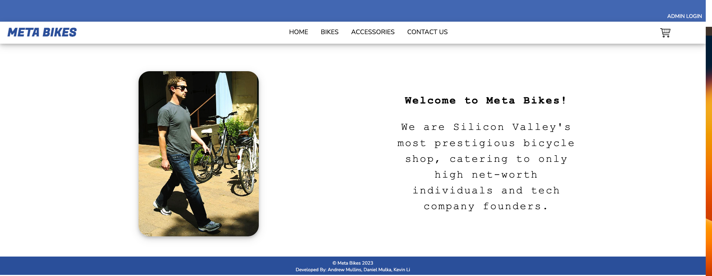

# META BIKES

---

Zuckerberg's very own e-commerce site specializing in high end bicycles and accessories.

## Project 
MetaBikes is a multi-page, full-stack, CRUD capable e-commerce site. 

## Functionality 

Navigate through the site's inventory of bikes and accessories.  

Click on any item you are interested in to get more info. 

Add and remove items from the cart.

Leave a comment. 

## Team 
- Kevin Li
- Andrew Mullins
- Daniel Mulka

## Modules 

    
Bike

     
    The Bike model stores all fields of data that might be relavent to a potential shopper. It is the parent to our cartitem object and contains the fields: 
    - type: String
    - brand: String
    - model: String
    - price: Number
    - color: String
    - weight: Number
    - description: String
    - img: String
    - category: String 

    
Accessory

    
     Accessories like bikes, stores all the data a shopper will need to know and is also a parent to cartitem. Accessories fields are:
    - type: String 
    - brand: String
    - item: String
    - price: Number
    - img: String
    - description: String 
    - category: String 
     

    
Cartitem

     The cartitem model is the child of both bike and accessory in a many to one relationship. Takes the ID of any bike or accessory and displays them in the cart. Fields are: 
   - bicycleID : bike id 
   - accessoryID: accessory id 
   - quantity : Number 

    
Comment

    Finally the comment mode allows shoppers to leave comments about the page. It takes thestrings generated on the front end to display messages on the admin page. Fields displayed. 
  - name: String 
  - email : String
  - description : String 
     

